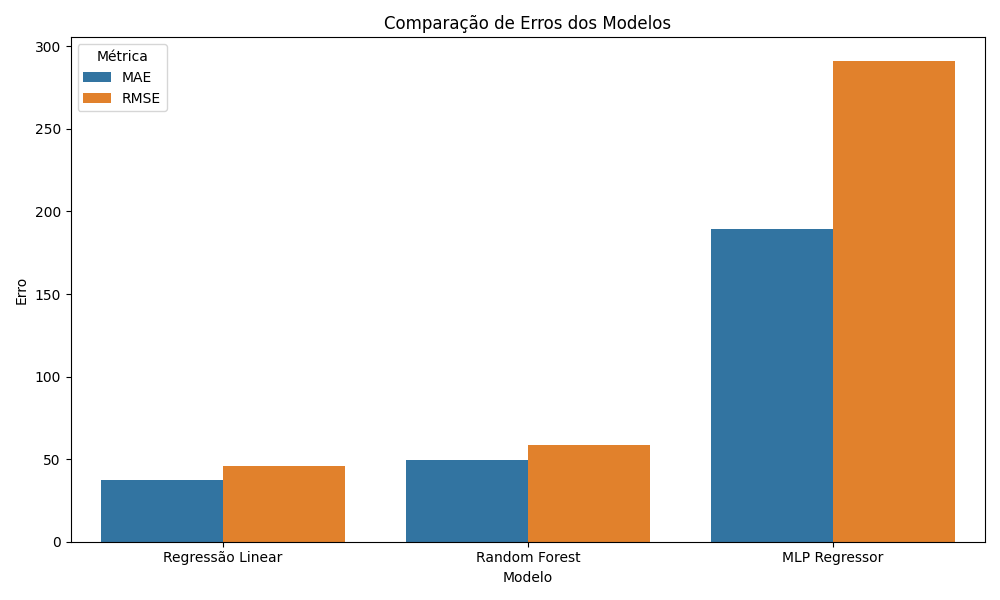

# Previsão de Demanda do Restaurante Universitário da UNICAMP

Este projeto tem como objetivo utilizar técnicas de **Python e Machine Learning** para prever a demanda diária de refeições no Restaurante Universitário (RU) da UNICAMP, buscando minimizar desperdícios e otimizar recursos.

## 📌 Objetivo

Desenvolver modelos preditivos com base em dados simulados que representem variáveis como:
- Dia da semana
- Ocorrência de eventos
- Tipo de cardápio
- Feriados e pontos facultativos
- Temperatura média

## 🧠 Modelos Aplicados

- Regressão Linear
- Random Forest Regressor
- Multilayer Perceptron (MLP)

## 🧪 Metodologia

1. **Pré-processamento:**

- Codificação one-hot da variável Dia_da_Semana
- Padronização (StandardScaler) para o MLP

2. **Divisão dos dados:**

- 70% para treino
- 30% para teste

3. **Modelos testados:**

- Regressão Linear
- Random Forest Regressor
- Multilayer Perceptron (MLP)

4. **Métricas de Avaliação:**

- MAE: Erro Médio Absoluto
- RMSE: Raiz do Erro Quadrático Médio
- R²: Coeficiente de DeterminaçãoPré-processamento de dados (one-hot encoding e padronização).

5. **Visualização gráfica dos erros e Conclusão:**

- Gráfico desenvolvido ao rodar o código
- Interpretação dos resultados e conclusão

## 📊 Resultados

| Modelo             | MAE   | RMSE  | R²    |
|--------------------|-------|-------|-------|
| Regressão Linear   | 31.08 | 37.89 | 0.92  |
| Random Forest      | 43.99 | 54.54 | 0.84  |
| MLP Regressor      | 79.36 | 103.46| 0.47  |

### Visualização dos Resultados

O gráfico acima mostra a comparação entre os erros MAE (Erro Médio Absoluto) e RMSE (Raiz do Erro Quadrático Médio) dos três modelos testados.

📌 **Conclusão**: A Regressão Linear foi o modelo que melhor se adaptou ao conjunto de dados simulado, possivelmente por sua natureza predominantemente linear.

## 📁 Arquivos

- `projetott005.py`: Código principal do projeto.
- `dados_simulados_RU.xlsx`: Base de dados simulada.
- `figures/comparacao_modelos.png`: Gráfico de comparação dos modelos gerado automaticamente.

## 🧾 Referências

- Ahmed, T. et al. (2024). A comparative study of various statistical and machine learning models for predicting restaurant demand in Bangladesh. PLOS ONE.

- Pedregosa, F. et al. (2011). Scikit-learn: Machine learning in Python. Journal of Machine Learning Research.

- Hunter, J. D. (2007). Matplotlib: A 2D graphics environment.

- Waskom, M. L. (2021). Seaborn: statistical data visualization.
